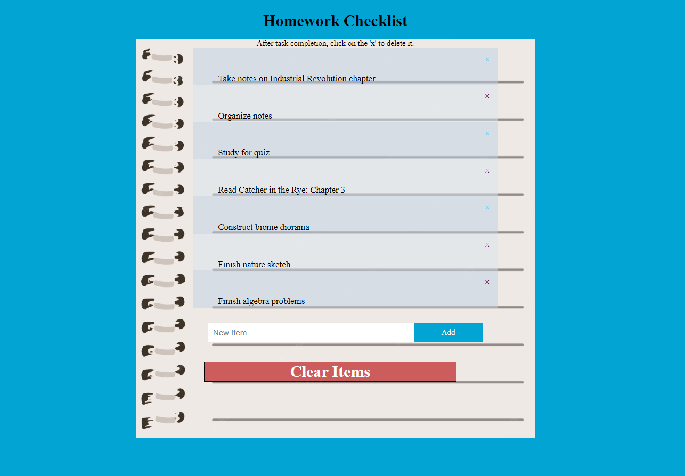

# homework-list-2.0-solution

Create a to-do list of items that correspond to your homework assignments.



## Objective

In this project, we will be using DOM to create and modify existing HTML elements.

Difficulty: Intermediate

## Prerequisites

To complete this project, students should have the following:

* Basic understanding of HTML structure and attributes.
* Basic understanding of CSS properties.
* Basic understanding of JavaScript and DOM.

## Part 1: Set Up

Upload the provided files:
* HTML file
* CSS file

Create the following:
* JS file

Link all of your files correctly.

## Part 2: Create a "close" button and append it to each list item

#### In the JavaScript file:
1. Create an array that gets all the elements with tag name "li". Create a variable named myNodeList to hold this array

2. Create a for-loop that iterates from var i = 0 to the length of the array. The for-loop should look like this:

```javascript
for (var i = 0; i < myNodeList.length; i++) {
  //insert code inside the for-loop here
}
```

Inside the for-loop:

3. Create a variable called 'span' and store in it a new element with the tag name "span"
   * ex: var foo = document.createElement("tagName");
 
4. Create a variable called 'txt' and store in it a new text node of the unicode for the multiplication sign, which looks like "x". The unicode for the multiplication sign is "\u00D7"
   * ex: var bar = document.createTextNode("\u00D7");

5. Set the className attribute of the span variable equal to "close"

6. Append the txt variable as the child node to span
    *	 ex: span.appendChild(var)
    
7. Append the span variable as the child node to the array myNodeList at index i
    *  ex: arr[i].appendChild(var)

## Part 3: Add “close” button functionality

1. Create an array called 'close' that gets all the elements with class name "close"
   
2. Next, copy and paste this code to stop displaying the list item when the close button is clicked. This code uses a for-loop to iterate through each element in the close array. Inside of the for-loop, we use a function to access the parent element of the current item when clicked, and set that element's style.display to "none". 

```JavaScript

for (i = 0; i < close.length; i++) {
  close[i].onclick = function() {
    var div = this.parentElement;
    div.style.display = "none";
  }
}
```

## Part 4: Check off the list item when item is clicked

1. Copy and paste this code to check off the list item when clicked. This code uses an event listener to check if the item clicked has the tagName 'li' and toggles the item to display a checkmark if true. 
```javascript
var list = document.querySelector('ul');
list.addEventListener('click', function(ev) {
if (ev.target.tagName === 'LI') {
ev.target.classList.toggle('checked');
}
}, false);
```

## Part 5: Create a new list item when “add” button is clicked

1. Create another function named newElement that takes no arguments.

Inside the function:

2. Create a variable called 'li' that creates an element with the tag name "li"

3. Create a variable called 'inputValue' that gets the value of the element with the ID "myInput"

4. Create a variable called 'newText' that creates a text node containing the inputValue variable
   * ex: var foo = document.createTextNode(inputValue);

5. Append the newText variable as the child to the li variable
   * ex: li.appendChild(var)
 
6. If the inputValue is empty, then write an alert telling the user they must type something. Use alert(). Else, input is valid. Get the element with the ID myUL. Then append the li variable to this element

7. Get the element with the ID myInput and set its value to ""

8. Create an element with the tag "span" and store it in a variable named 'span'

9. Create an element with the tag "\u00D7" and store it in a variable named 'txt'
 
10. Set the className attribute of the span variable equal to "close"

11. Append the txt variable as the child node to span
    * ex: span.appendChild(txt)
  
12. Append the span variable as the child node to the li variable
    * ex: li.appendChild(span)

13. Next, create the same for-loop from Part 3. Copy and paste this code to stop displaying the list item when the close button is clicked.

```JavaScript

for (i = 0; i < close.length; i++) {
  close[i].onclick = function() {
    var div = this.parentElement;
    div.style.display = "none";
  }
}
```

14. Close your function!

## Part 6: Create the removeAll() function to add functionality to the “Clear Items” button

1. Create a function called 'removeAll' that takes no parameters.

Inside the function:

2. Change to Get all the elements with the tag name "ul" and store this in a variable named 'list'

4. Set the innerHTML of the first element of list to ""

## Stretch Goals
* Use DOM to change the style/color of the items  
* Use DOM to append text onto the end of the item element to specify an estimated time that the assignment may take
